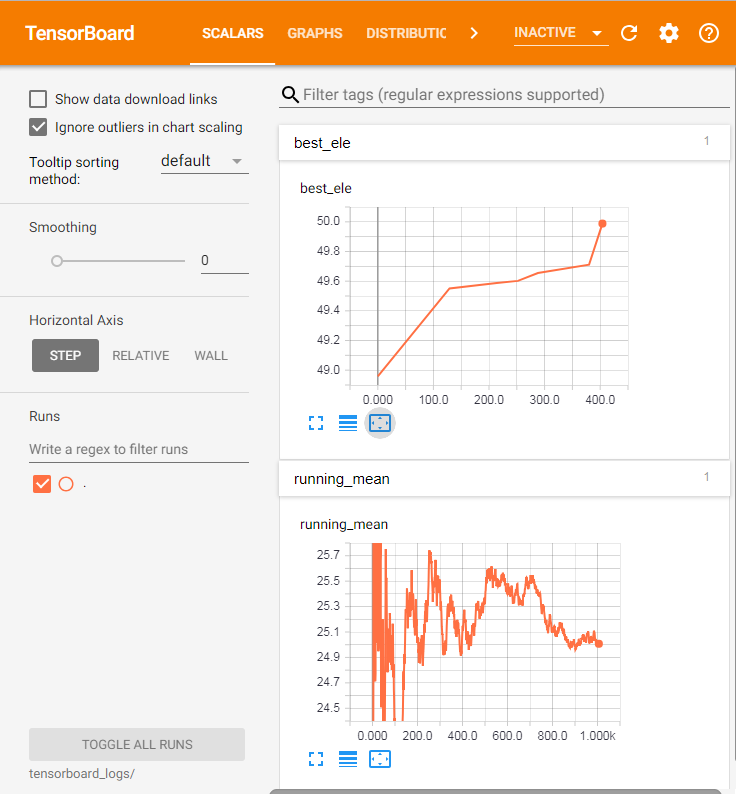
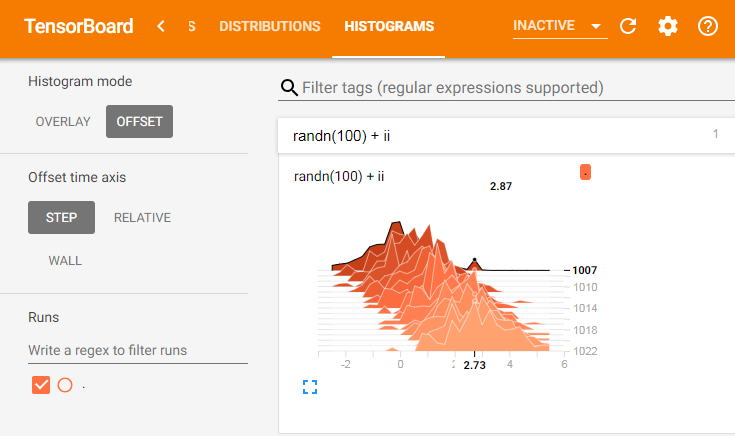

# UniversalTensorBoard
** Deprecated in favor of https://github.com/PhilipVinc/TensorBoardLogger.jl/ **

[](https://oxinabox.github.io/UniversalTensorBoard.jl/stable)
[](https://oxinabox.github.io/UniversalTensorBoard.jl/latest)
[](https://travis-ci.org/oxinabox/UniversalTensorBoard.jl)
[](https://ci.appveyor.com/project/oxinabox/UniversalTensorBoard-jl)
[](https://codecov.io/gh/oxinabox/UniversalTensorBoard.jl)
[](https://coveralls.io/github/oxinabox/UniversalTensorBoard.jl?branch=master)


This is a proof of concept for using TensorBoard for arbitrary numeric logging.
You could use it with Flux.jl,  or with what ever else you want.

Won't work on Windows, because TensorFlow.jl does't work on Windows

## Usage
usage is very simple

 - `@tb_log foo` to log the current value of `foo`.
 - `set_tb_logdir(new_dir)` sets the logging directory to `new_dir`
 - `reset_tb_logs()` clears all current logs
 - `tensorboard()` opens TensorBoard in your default browser (or you can open it manually the normal way)


## Example

### Scalars

```
using UniversalTensorBoard

best_ele = -1
total = 0
for (ii, ele) in enumerate(50rand(1_000))
    if ele > best_ele
        best_ele=ele
        @tb_log best_ele
    end
    total+=ele
    running_mean = total/ii
    @tb_log running_mean
end
```



### Vectors -> Histograms

```
using UniversalTensorBoard

for ii in 0:0.2:3
    @tb_log randn(100)+ii
end
```



